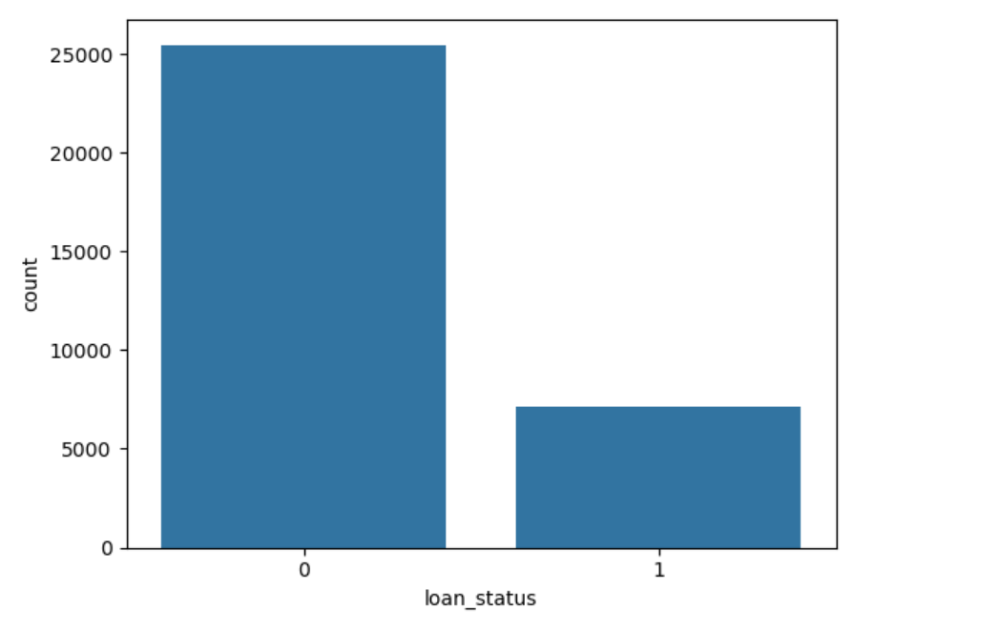
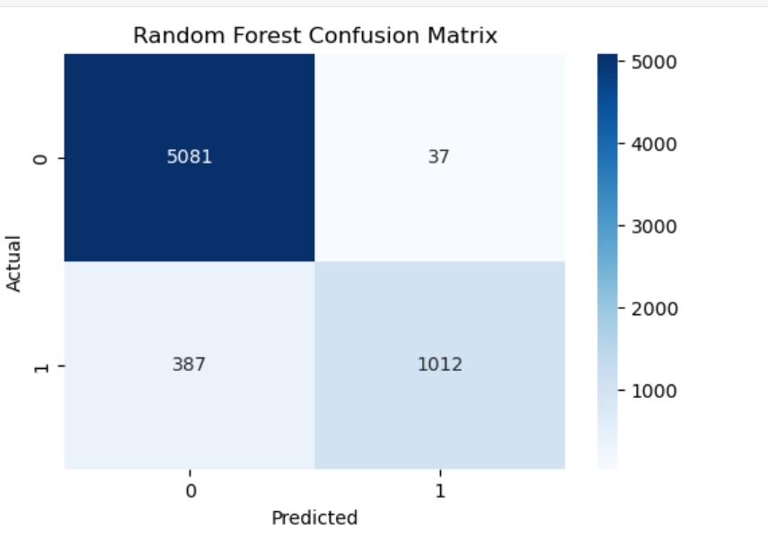
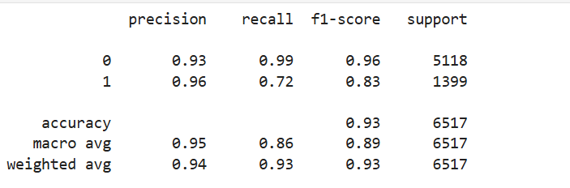
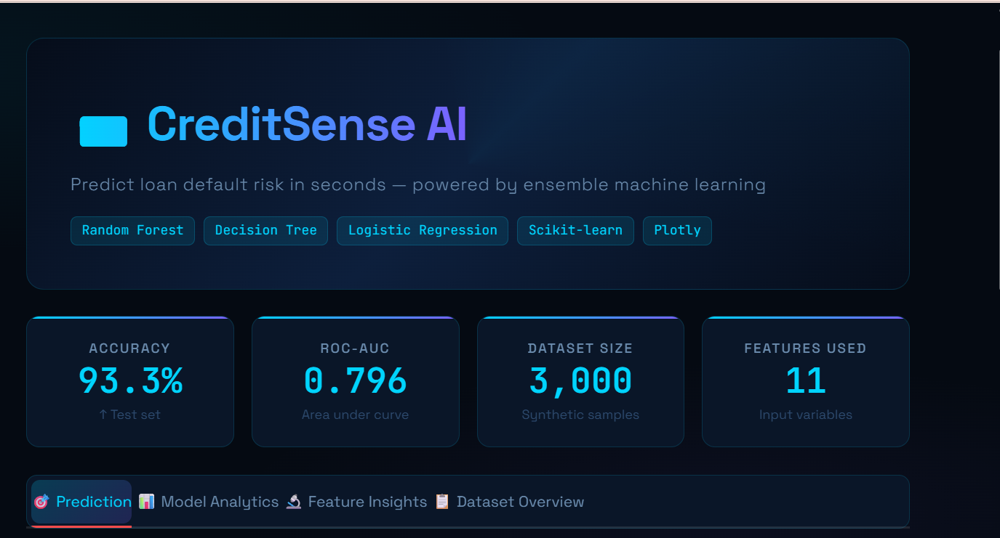
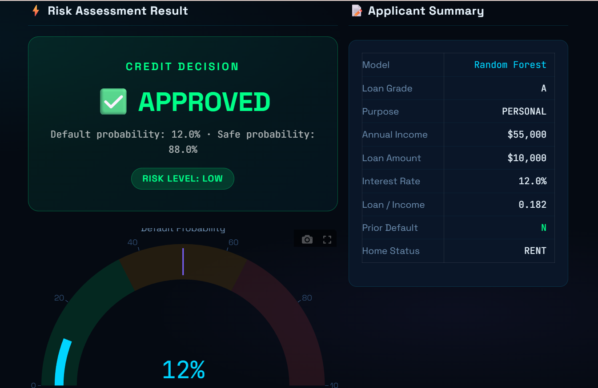
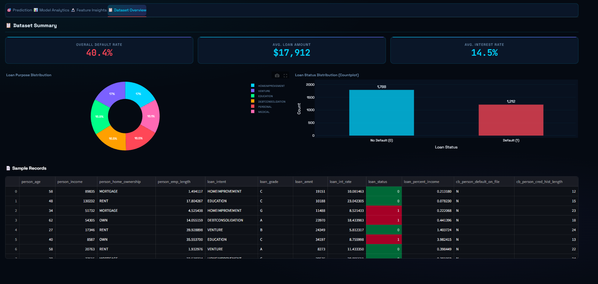
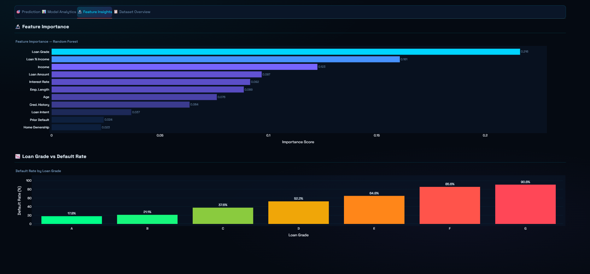
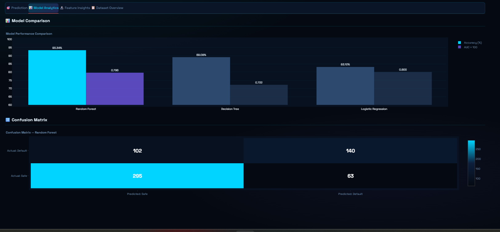

# 💳 Credit Scoring & Loan Default Prediction System


## 📌 Project Overview

The Credit Scoring & Loan Default Prediction System is a Machine Learning-based application designed to assess the creditworthiness of loan applicants and predict the likelihood of loan default. Financial institutions can use this system to make informed lending decisions, minimize risk, and improve loan approval processes.

This project utilizes historical customer financial data, applies data preprocessing techniques, trains machine learning models, and provides predictions through an interactive Streamlit web application.

---

## 🎯 Objectives

* Predict whether a loan applicant is likely to default.
* Analyze financial and demographic factors affecting credit risk.
* Compare multiple machine learning algorithms for performance evaluation.
* Provide an easy-to-use web interface for real-time predictions.

---

## 📊 Dataset

The dataset contains customer financial and demographic information, including:

* Age
* Income
* Loan Amount
* Credit History
* Employment Status
* Debt-to-Income Ratio
* Existing Loans
* Credit Score
* Loan Status (Target Variable)

> Note: Dataset used for educational and research purposes.

---

## 🛠️ Technologies Used

### Programming Language

* Python

### Libraries

* Pandas
* NumPy
* Scikit-learn
* Matplotlib
* Seaborn
* Joblib

### Deployment

* Streamlit

---

## 🔍 Exploratory Data Analysis (EDA)

The following analyses were performed:

* Data Cleaning
* Missing Value Handling
* Feature Distribution Analysis
* Target Variable Analysis

### Feature Distribution



The distribution plot helps understand the spread and behavior of key financial variables within the dataset.

### Correlation Heatmap



The heatmap highlights relationships between features and helps identify important variables influencing credit risk.

---

---

## 🤖 Machine Learning Models

The following algorithms were implemented and evaluated:

1. Logistic Regression
2. Random Forest Classifier
3. K-Nearest Neighbors (KNN)

Performance metrics include:

* Accuracy
* Precision
* Recall
* F1-Score
* Confusion Matrix

### Model Evaluation



The confusion matrix provides a detailed view of prediction performance by showing true positives, true negatives, false positives, and false negatives.

---


---

## ⚙️ Project Workflow

### Step 1: Data Collection

Load and inspect the dataset.

### Step 2: Data Preprocessing

* Handle missing values
* Encode categorical variables
* Feature scaling
* Train-test split

### Step 3: Model Training

Train multiple machine learning models.

### Step 4: Model Evaluation

Evaluate models using classification metrics.

### Step 5: Model Selection

Select the best-performing model.

### Step 6: Deployment

Deploy the trained model using Streamlit.

---

## 📈 Accuracy Scores


| Model               | Accuracy |
| ------------------- | -------- |
| Logistic Regression | 83.12%   |
| Random Forest       | 89.09%   |
| KNN                 | 93.34%   |


---

## 🖥️ Streamlit Application Features

* User-friendly graphical interface
* Real-time credit risk prediction
* Instant model output
* Easy data input form
* Fast and responsive performance
* PDF Generate of Output

### Dashboard View



The dashboard presents key insights, model statistics, and visual analytics in an interactive format.

### Prediction Interface



Users can enter applicant information and instantly receive a credit risk prediction generated by the trained machine learning model.

### Data Overview


Provides a summary of the dataset, including record counts, feature information, and data quality insights.

### Feature Insights


Interactive visualizations highlighting feature distributions and their impact on credit risk prediction.

### Model Analytics


Displays model performance metrics, accuracy scores, confusion matrix, and comparative analysis.


## 📂 Project Structure

```text
credit-scoring-system/
│
├── app.py
├── credit_score_model.ipynb
├
├── requirements.txt
├── README.md
│
├── data/
│   └── credit_data.csv
│
├── images/
│   ├── dashboard.png
│   ├── confusion_matrix.png
│   └── feature_importance.png
│
└── models/
    └── credit_score.pkl
```

---

## 🚀 Installation & Usage

### Clone Repository

```bash
git clone https://github.com/rizwanahmed786508/credit-scoring-system.git
cd credit-scoring-system
```

### Install Dependencies

```bash
pip install -r requirements.txt
```

### Run Streamlit App

```bash
streamlit run app.py
```

---

## 📋 Sample Prediction Process

1. Enter customer financial information.
2. Click the Predict button.
3. The model analyzes the data.
4. Risk prediction is displayed instantly.

## 🌐 Live Demo

Try the deployed application here:


🔗 []([https://your-app-url.streamlit.ap](https://credit-scoring-system-kgsxmwuhqibn6mcqvbw7rz.streamlit.app))


## 🔮 Future Enhancements

* XGBoost Implementation
* Hyperparameter Tuning
* Model Explainability using SHAP
* Cloud Deployment
* API Integration
* Deep Learning Models

---

## 👨‍💻 Author

**Rizwan Ahmed**

Software Engineering Student
Machine Learning & Data Science Enthusiast

GitHub: https://github.com/rizwanahmed786508

---

## 📜 License

This project is developed for educational, research, and portfolio purposes.
